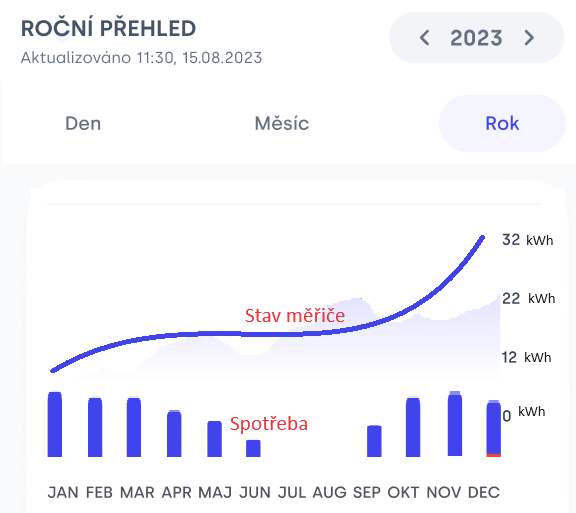

# beit-test-01

One of the features of our mobile app is real-time view over consumptions in your household.

This is rough design of the feature, with detailed view of consumption of single meter over the year. 
User can select different time frames: screenshot shows a year divided into months, other options are month divided into days and day divided into hours.



## Level 1

File [data-full.json](data-full.json) contains hourly **measurement** data of such a meter over the course of a year.

Your task is to implement Java method `getYearChartData` with signature as in following snippet, and design structure of `YearChartData` class:

```java

public YearChartData getYearChartData(int year);

```

The implementation needs to
* read data from provided `data-full.json` file
* find and return data for the chart 
  * measured values at the start of each month, including the final value which is start of next year (13 values : 1.1. 00:00 , 1.2. 00:00 , ... , 1.1.2024 00:00)
  * consumption for each month as difference between measurements at the end and start of that month (12 values)
* Work with Europe/Prague time zone (timestamps in the data are in UTC)

## Level 2

Same as level 1, but use [data-scarse.json](data-scarse.json) as data source. This file does not contain all data points. Where the data is missing, find a value using linear interpolation from nearest datapoints before and after desired time stamp.


## Level 3

User can choose different time frames. Not just whole year by months, but also single month whith days in the chart, or even single day with hours in the chart.
Use `data-scarse.json` as in Level 2 and generalize the code to implement following:

```java

public ChartData getChartData(OffsetDateTime periodFrom, OffsetDateTime periodTo, TimeUnit granurality);

enum TimeUnit {
  MONTH,
  DAY,
  HOUR
}
```

`periodFrom` and `periodTo` are the border times of selected time range: e.g. `2023-01-02T00:00+01:00` - `2023-01-03T00:00+01:00` for the day of 2. 1. 2023; or `2023-02-01T00:00+01:00` - `2023-03-01T00:00+01:00` for the month of February 2023.
`granurality` is how the period should be divided. For example, with `periodFrom`-`periodTo` defining a day's range, and `granurality == HOUR`, the result should return 25 hourly measurements and 24 hourly consumptions. Using the same granularity for the whole month of February would yield 28*24 hourly consumption values.

